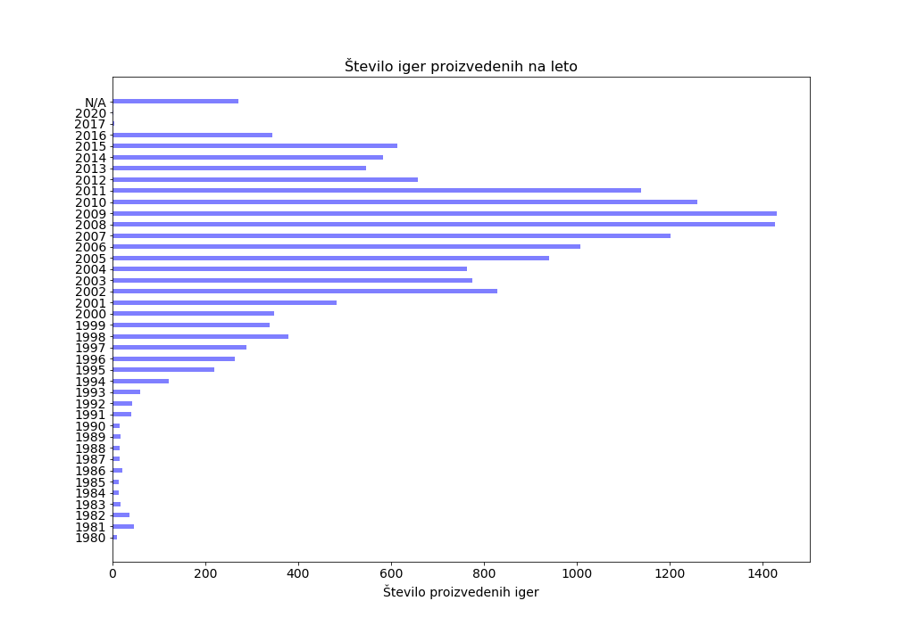
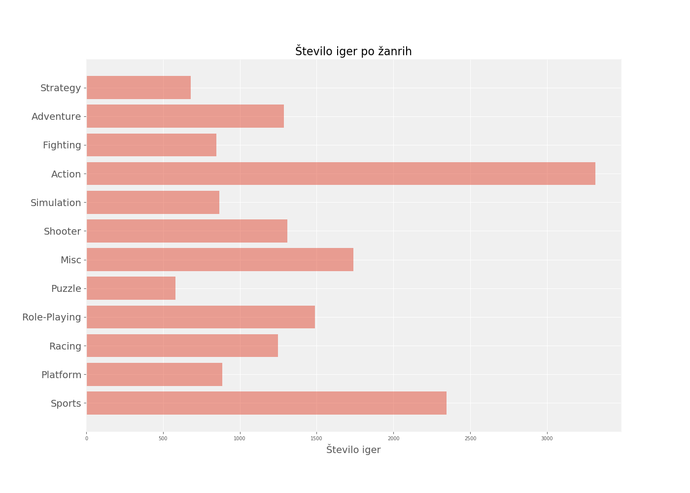

# Analiza video iger ter platform
## Vmesno poročilo
## Ekipa
* Mitja Hrovatič
* Anže Tomažin
* Matej Fortuna

## Podatki
Vir podatkov: https://www.kaggle.com/gregorut/videogamesales

Podatke smo pridobili iz strani Kaggle v formatu "csv".
Podatki vsebujejo podatke o video igrah od 1980 do 2016.

Vključujejo atribute:

* Rank - Uvrstitev celotne prodaje
* Name - Ime igre
* Platform - Igra izdana za platformo (npr. PC, PS4 itd.)
* Year - Leto izdaje igre
* Genre - Žanr igre
* Publisher - založnik igre
* NA_Prodaja - Prodaja v Severni Ameriki (v milijonih)
* EU_Prodaja - Prodaja v Evropi (v milijonih)
* JP_Prodaja - Prodaja na Japonskem (v milijonih)
* Other_Sales - Preostala prodaja (v milijonih)
* Global_Sales - Skupna svetovna prodaja.

### Odkrivanje strukture podatkov
Analizira smo podatke in ugotovili, da pri posameznih atributih prihaja do pomankljivosti. Pri nekaterih igrah ni podatka za leto izdaje ter so označene z *N/A*, naktere igre nimajo znanega založnika ter so označene z *Unknown*.

Število platform | Število iger | Število žanrov | Število založnikov | Skupno število prodanih iger (milijon)
---------------- | ------------ | -------------- | ------------------ | ----------------------------
31               | 11493        | 12             | 579                | 8920.44

 

Naziv igre | Število izdaj | Leta izdaje | Založnik 
 - | - | - | -
Need for Speed: Most Wanted | 12 | 2005, 2012, 2012, 2005, 2012, 2005, 2005, 2005, 2013, 2005, 2005, 2012 | Electronic Arts
LEGO Marvel Super Heroes | 9 | 2013, 2013, 2013, 2013, 2013, 2013, 2013, 2013, 2013 | Warner Bros. Interactive Entertainment
FIFA 14 | 9 | 2013, 2013, 2013, 2013, 2013, 2013, 2013, 2013, 2013 | Electronic Arts
Ratatouille | 9 | 2007, 2007, 2007, 2007, 2007, 2007, 2007, 2007, 2007 | THQ
Madden NFL 07 | 9 | 2006, 2006, 2006, N/A, 2006, 2006, 2006, 2006, 2006 | Electronic Arts, Unknown
LEGO Harry Potter: Years 5-7 | 8 | N/A, N/A, N/A, N/A, N/A, N/A, 2012, N/A | Warner Bros. Interactive Entertainment
LEGO Jurassic World | 8 | 2015, 2015, 2015, 2015, 2015, 2015, 2015, 2015 | Warner Bros. Interactive Entertainment
The LEGO Movie Videogame | 8 | 2014, 2014, 2014, 2014, 2014, 2014, 2014, 2014 | Warner Bros. Interactive Entertainment
Lego Batman 3: Beyond Gotham | 8 | 2014, 2014, 2014, 2014, 2014, 2014, 2014, 2014 | Warner Bros. Interactive Entertainment
LEGO The Hobbit | 8 | 2014, 2014, 2014, 2014, 2014, 2014, 2014, 2014 | Warner Bros. Interactive Entertainment
FIFA 15 | 8 | 2014, 2014, 2014, 2014, 2014, 2014, 2014, 2014 | Electronic Arts
Angry Birds Star Wars | 8 | 2013, 2013, 2013, 2013, 2013, 2013, 2013, 2013 | Activision
Terraria | 8 | 2013, 2013, 2011, 2013, 2016, 2014, 2014, 2016 | 505 Games, Unknown, Screenlife
FIFA Soccer 13 | 8 | 2012, 2012, 2012, 2012, 2012, 2012, 2012, 2012 | Electronic Arts
Madden NFL 08 | 8 | 2007, 2007, 2007, 2007, 2007, 2007, 2007, 2007 | Electronic Arts
Cars | 8 | 2006, 2006, 2006, 2006, 2006, 2006, 2006, 2006 | THQ
LEGO Star Wars II: The Original Trilogy | 8 | 2006, 2006, 2006, 2006, 2006, 2006, 2006, 2006 | LucasArts, Activision
Monopoly | 8 | 1994, 2008, 1997, 2008, 2008, 2008, 2010, 1999 | Hasbro Interactive, Electronic Arts
LEGO Marvel's Avengers | 7 | 2016, 2016, 2016, 2016, 2016, 2016, 2016 | Warner Bros. Interactive Entertainment
Lego Star Wars: The Force Awakens | 7 | 2016, 2016, 2016, 2016, 2016, 2016, 2016 | Warner Bros. Interactive Entertainment
 
 

## Cilji in vprašanja
Tekom analize izbranih podatkov, bomo poizkušali doseči cilje oz. odgovoriti na naslednja vprašanja:

* Kakšne tržne deleže imajo posamezni založniki iger in platforme? Ali po kontinentih prevladujejo različni založniki in platforme?
* Ali imajo založniki večji tržni delež, če izdajo več iger? Ali obratno?
* Koliko izdaj je doživela posamezna igra? Ali to vpliva na prodajo oz. tržni delež? Ali je igra bolj popularna, če ima več izdaj?
* Kakšen je trend proizvodnje iger za posamezne platforme? Ali se povečuje število iger za PC?
* Kakšen je trend proizvodnje iger? Kako proizvodnja skozi leta niha? Ali kateri izmed žanrov izstopa? Za katere platforme se izdeluje največ iger?
* Kako so porazdeljeni posamezni žanri iger glede na platformo? (vzamemo zanimiv primer platforme)
* Katere so najbolj popularne igre ter platforme na katerih se igrajo igre (PC, PS4 itd.)?
* Katere igre so najbolj prodajne?
* Največ proizvedenih iger po letih
* Najbolj popularen žaner iger
* Kateri založniki iger so najbolj priljubljeni?
* Prodaja posameznih iger glede na trg (USA, EU, JPN) ter globalno
* Kako veliko se igra igre po različnih državah sveta (USA, EU, JPN) ter na katerih platformah? Ali je res, da so Američani najbolj igričarski narod?
* Ali so posamezni žanri iger bolj podvrženi določenim platformam?
